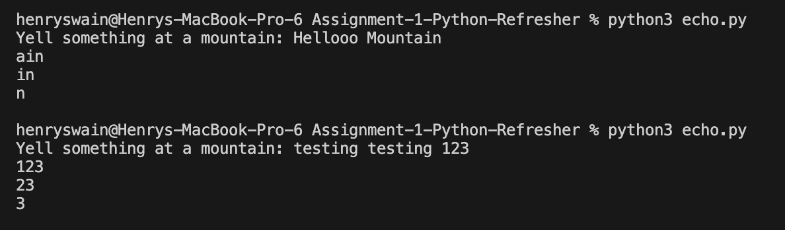
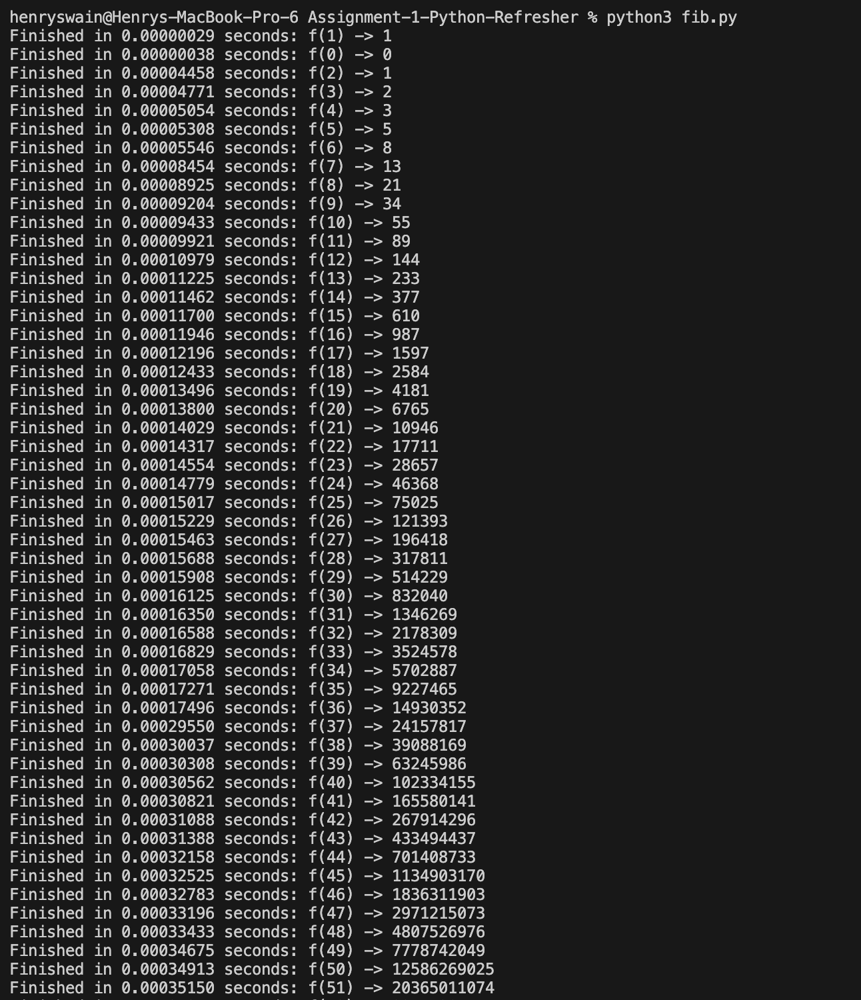
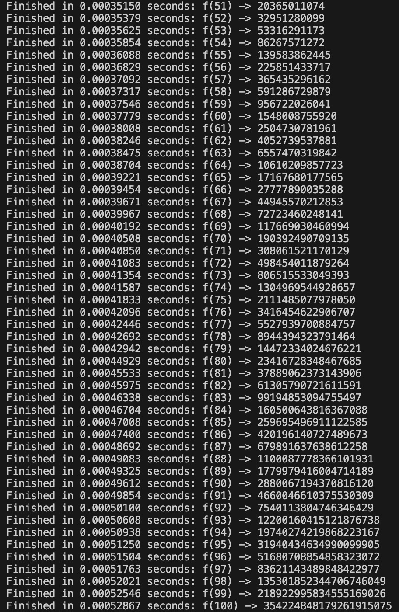
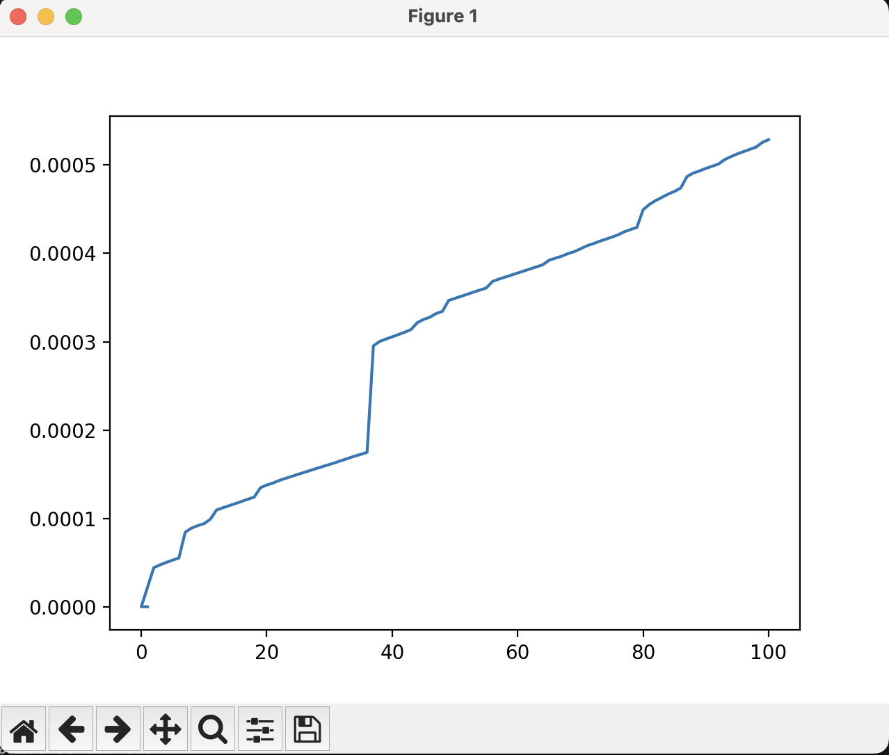

# Assignment 1: Python Refresher
## This assignment contained two parts:
### Part 1: echo.py
To run the code, run `python3 echo.py` in the terminal from the root directory.

When prompted with "Yell something at a mountain", enter whatever you want to see echoed back (e.g. "Hellooo Mountain" or "testing testing 123")

### Part 1: fib.py
To run the code, run `python3 fib.py` in the terminal from the root directory.

executing the code will calculate the nth number in the fibonacci sequence (from the 0th to 100th), and the runtime for each calculation, along with a graph showing the corellation between the two.

Normally, one would expect the runtime to grow exponentially. However, with the help of python's built-in `lru_cache` decorator from the the `functools` module, python can reduce the time increase to linear. It is albe to do this by storing the results of the function it decorates with particular arguments in the cache such that if the function is called again with those same arguments, it returns the cached result again instead of recomputing

